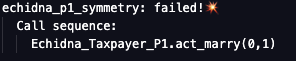
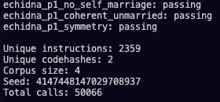
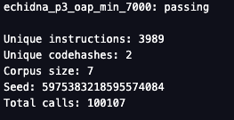

# SSA Project

This repository contains the coursework project for *Security in Software Applications*.

The goal is to define **security properties (things that must NOT happen)**, use **Echidna** to find counterexamples, identify the **root cause**, implement a **fix**, and re-run Echidna until all properties are green.

This README documents what has been completed so far (Day 0 setup + Taxpayer Parts 1–3 + Lottery commit–reveal fuzzing).

## What has been completed so far

### 1) Reproducible Echidna setup (Docker)
To avoid local toolchain inconsistencies, Echidna is executed via Docker (linux/amd64).

- Echidna is run from the public Docker image `trailofbits/echidna:latest`.
- Echidna configuration files are stored in `echidna/`.
- Logs are saved under `artifacts/logs/`.
- Corpus is saved under `artifacts/corpus/`.

A minimal “dummy” contract was used to validate that the pipeline works end-to-end.

### 2) Taxpayer — Part 1 (Marriage correctness)

#### Threat model (one line)
An attacker (or a buggy user flow) attempts to drive the contract state into an inconsistent marriage state (e.g., unilateral marriage, self-marriage, or incoherent references).

#### Properties implemented
Property-based tests were implemented in Echidna to check **state invariants**.

- **P1.1 Symmetry**: if A is married to B (spouse != 0), then B must be married to A.
- **P1.2 No self-marriage**: a taxpayer must never be married to itself.
- **P1.3 Coherent “unmarried”**: if A is unmarried, then no one should point to A as spouse.

Because `Taxpayer` is deployed as one contract instance per person and `spouse`/`isMarried` are not public, a small harness was created to expose read-only getters for the properties.

#### Counterexample → fix → re-test
Echidna quickly found violations for all three properties (examples include self-marriage and unilateral marriage). After fixing the contract logic (input validation and bilateral consistency), all three properties pass under a 50,000-test run.

### 3) Taxpayer — Part 2 (Allowance baseline + pooling conservation)

#### Threat model (one line)
An attacker or buggy flow attempts to violate allowance baseline or conservation properties in spouse allowance pooling and transfers.

#### Properties implemented
Property-based tests were implemented to check:

- Unmarried baseline allowance equals 5000.
- Conservation for reciprocal spouses: sum of allowances equals 10000.

#### Counterexample → fix → re-test
Echidna found that divorce did not reset allowance to baseline, leading to 4999 after divorce. Also, transfers were allowed without enforcing reciprocal spouse relationship. The fix involved strict preconditions in `transferAllowance` and resetting allowance on `divorce/divorceBack`. After these fixes, all properties pass under 100,000 tests.

### 4) Taxpayer — Part 3 (Age ≥ 65 ⇒ allowance floor 7000)

#### Threat model (one line)
A user (or attacker) attempts to push the contract into a state where an older taxpayer (age ≥ 65) ends up with an allowance lower than the required minimum.

#### Properties implemented
Property-based tests were implemented to check:

- **P3.1 OAP minimum allowance**: if `age >= 65`, then `tax_allowance >= 7000` must always hold.

The harness was extended with a getter for `age` so that the property can observe the internal state.

#### Counterexample → fix → re-test
Echidna found that after aging to 65, the allowance could remain at 5000, and later flows (e.g., divorce / transfers) could violate the age-based floor.

The fix introduced an age-aware baseline and a refresh step whenever state changes may impact the allowance:
- an internal `baseline` function that returns 5000 or 7000 based on the current age
- a `refresh` function that enforces `tax_allowance >= baseline`
- calling the refresh after `haveBirthday()` and during divorce logic, plus a strict precondition in `transferAllowance` so that an OAP cannot transfer below the minimum

After applying the fix, the property passes under a 100,000-test run.

### 5) Taxpayer — Consolidation (Echidna_All: P1–P3 together)

After finishing Parts 1–3, the properties were consolidated into a single Echidna suite (`Echidna_All.sol`) to ensure that **all invariants hold together** in the same state space.

#### Properties consolidated
- Symmetry
- No self-marriage
- Unmarried baseline (age-aware)
- OAP minimum allowance (age ≥ 65 ⇒ allowance ≥ 7000)
- Pooling conservation for reciprocal spouses (sum equals the baseline sum)

#### Runs executed
- Smoke run (quick regression): log saved as `artifacts/logs/all_smoke.txt`
- Release evidence (long run, 300k calls): log saved as `artifacts/logs/all_release.txt`

### 6) Lottery — Commit–Reveal (Part 4)

The `Lottery` contract implements a basic commit–reveal protocol with phases (start → commit → reveal → end). A dedicated harness and Echidna suite were added to validate key safety properties and to drive the contract through phase transitions.

#### Properties implemented
- **L1 Binding**: a revealed value must match the prior commitment (`keccak256(abi.encode(rev)) == commit[msg.sender]`).
- **L2 Phase gating**: commit/reveal/end must not be callable outside the correct phase (e.g., no commit before start, no reveal before revealTime, no end before endTime).
- **L3 Unique reveals**: the same participant must not be able to appear twice in the `revealed` list.

#### Runs executed
- Smoke run: `artifacts/logs/lottery_PASS_smoke.txt`
- Release evidence (80k calls): `artifacts/logs/lottery_PASS_release.txt`

Note: early failing runs were saved as `artifacts/logs/lottery_FAIL_initial.txt`.

## How to reproduce

### Prerequisites
- Docker installed and running.

### 1) Dummy sanity check

```bash
docker run --rm --platform linux/amd64 \
  -v "$PWD":/src -w /src \
  trailofbits/echidna:latest \
  echidna-test tests/echidna/Echidna_Dummy.sol --config echidna/dummy.yaml \
  | tee artifacts/logs/dummy.txt
```

### 2) Taxpayer Part 1 (P1)

```bash
docker run --rm --platform linux/amd64 \
  -v "$PWD":/src -w /src \
  trailofbits/echidna:latest \
  echidna-test tests/echidna/Echidna_Taxpayer_P1.sol \
    --config echidna/taxpayer.yaml \
    --contract Echidna_Taxpayer_P1 \
  | tee artifacts/logs/taxpayer_p1_run.txt
```

Notes:
- The `--contract Echidna_Taxpayer_P1` flag is required because multiple contracts are present in the compilation unit.
- Minor `Ticker: poll failed: Interrupted system call` messages may appear in container logs; they do not affect correctness.

### 3) Taxpayer Part 2 (P2)

```bash
docker run --rm --platform linux/amd64 \
  -v "$PWD":/src -w /src \
  trailofbits/echidna:latest \
  echidna-test tests/echidna/Echidna_Taxpayer_P2.sol \
    --config echidna/taxpayer_p2.yaml \
    --contract Echidna_Taxpayer_P2 \
  | tee artifacts/logs/taxpayer_p2_run.txt
```

### 4) Taxpayer Part 3 (P3)

```bash
docker run --rm --platform linux/amd64 \
  -v "$PWD":/src -w /src \
  trailofbits/echidna:latest \
  echidna-test tests/echidna/Echidna_Taxpayer_P3.sol \
    --config echidna/taxpayer_p3.yaml \
    --contract Echidna_Taxpayer_P3 \
  | tee artifacts/logs/taxpayer_p3_run.txt
```

### 5) Taxpayer Consolidation (All: P1–P3 together)

Smoke run:

```bash
docker run --rm --platform linux/amd64 \
  -v "$PWD":/src -w /src \
  trailofbits/echidna:latest \
  echidna-test tests/echidna/Echidna_All.sol \
    --config echidna/all.yaml \
    --contract Echidna_All \
  | tee artifacts/logs/all_smoke.txt
```

Release evidence (long run):

```bash
docker run --rm --platform linux/amd64 \
  -v "$PWD":/src -w /src \
  trailofbits/echidna:latest \
  echidna-test tests/echidna/Echidna_All.sol \
    --config echidna/all.yaml \
    --contract Echidna_All \
  | tee artifacts/logs/all_release.txt
```

Notes:
- `echidna/all.yaml` should set a higher `testLimit` (e.g., 300000) for the release run.
- Minor `Ticker: poll failed: Interrupted system call` messages may appear; they do not affect correctness.

### 6) Lottery commit–reveal (Part 4)

Smoke / release runs (config controls `testLimit`):

```bash
docker run --rm --platform linux/amd64 \
  -v "$PWD":/src -w /src \
  trailofbits/echidna:latest \
  echidna-test tests/echidna/Echidna_Lottery.sol \
    --config echidna/lottery.yaml \
    --contract Echidna_Lottery \
  | tee artifacts/logs/lottery_PASS_smoke.txt
```

For a longer run, increase `testLimit` in `echidna/lottery.yaml` (e.g., 80000) and save as:

```bash
docker run --rm --platform linux/amd64 \
  -v "$PWD":/src -w /src \
  trailofbits/echidna:latest \
  echidna-test tests/echidna/Echidna_Lottery.sol \
    --config echidna/lottery.yaml \
    --contract Echidna_Lottery \
  | tee artifacts/logs/lottery_PASS_release.txt
```

## Evidence locations

### Logs (raw)
- `artifacts/logs/all_smoke.txt`
- `artifacts/logs/all_release.txt`
- `artifacts/logs/lottery_FAIL_initial.txt`
- `artifacts/logs/lottery_PASS_smoke.txt`
- `artifacts/logs/lottery_PASS_release.txt`

### Curated evidence bundle
A curated copy of the key artifacts is kept under `artifacts/evidence/`.

- Taxpayer consolidated release log: `artifacts/evidence/all_release.txt`
- Lottery logs: `artifacts/evidence/lottery/`
  - `lottery_FAIL_initial.txt`
  - `lottery_PASS_smoke.txt`
  - `lottery_PASS_release.txt`

### Screenshots
Screenshots are stored in:
- `artifacts/evidence/screenshots/`

Current filenames:
- `P1_FAIL_symmetry.png`
- `P1_PASS.png`
- `P2_FAIL_pooling.png`
- `P2_PASS.png`
- `P3_FAIL_oap_min.png`
- `P3_PASS_oap_min.png`
- `ALL_PASS_smoke.png`

### Embedded screenshots







### Corpus
- Taxpayer: `artifacts/corpus/all/`
- Lottery: `artifacts/corpus/lottery/`

## Current status
- Day 0 tooling + sanity check: completed
- Taxpayer Part 1 (P1): completed (properties implemented, counterexamples captured, fixes applied, re-test passing)
- Taxpayer Part 2 (P2): completed (properties implemented, counterexamples captured, fixes applied, re-test passing)
- Taxpayer Part 3 (P3): completed (properties implemented, counterexamples captured, fixes applied, re-test passing)
- Taxpayer Consolidation (All: P1–P3 together): completed (smoke + long run release evidence passing)
- Lottery commit–reveal (Part 4): completed (properties implemented + smoke + release evidence passing)
