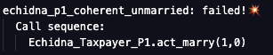
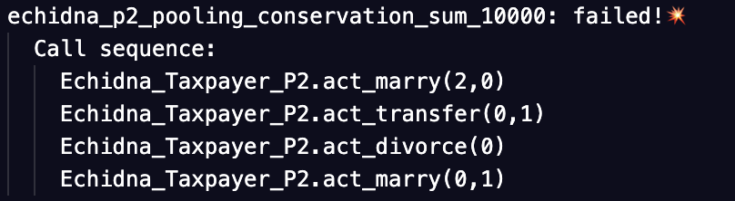
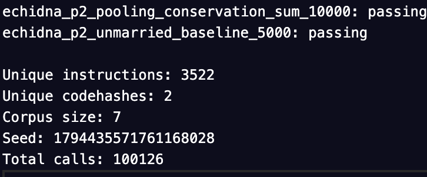

# SSA Project

This repository contains the coursework project for *Security in Software Applications*.

The goal is to define **security properties (things that must NOT happen)**, use **Echidna** to find counterexamples, identify the **root cause**, implement a **fix**, and re-run Echidna until all properties are green.

This README documents what has been completed so far (Day 0/Day 1 setup + Taxpayer Parts 1–3).

## What has been completed so far

### 1) Reproducible Echidna setup (Docker)
To avoid local toolchain inconsistencies, Echidna is executed via Docker (linux/amd64).

- Echidna is run from the public Docker image `trailofbits/echidna:latest`.
- Echidna configuration files are stored in `echidna/`.
- Logs are saved under `artifacts/logs/`.
- Corpus is saved under `artifacts/corpus/`.

A minimal “dummy” contract was used to validate that the pipeline works end-to-end.

### 2) Taxpayer — Part 1 (Marriage correctness)

#### Threat model (one line)
An attacker (or a buggy user flow) attempts to drive the contract state into an inconsistent marriage state (e.g., unilateral marriage, self-marriage, or incoherent references).

#### Properties implemented
Property-based tests were implemented in Echidna to check **state invariants**.

- **P1.1 Symmetry**: if A is married to B (spouse != 0), then B must be married to A.
- **P1.2 No self-marriage**: a taxpayer must never be married to itself.
- **P1.3 Coherent “unmarried”**: if A is unmarried, then no one should point to A as spouse.

Because `Taxpayer` is deployed as one contract instance per person and `spouse`/`isMarried` are not public, a small harness was created to expose read-only getters for the properties.

#### Counterexample → fix → re-test
Echidna quickly found violations for all three properties (examples include self-marriage and unilateral marriage). After fixing the contract logic (input validation and bilateral consistency), all three properties pass under a 50,000-test run.

### 3) Taxpayer — Part 2 (Allowance baseline + pooling conservation)

#### Threat model (one line)
An attacker or buggy flow attempts to violate allowance baseline or conservation properties in spouse allowance pooling and transfers.

#### Properties implemented
Property-based tests were implemented to check:

- Unmarried baseline allowance equals 5000.
- Conservation for reciprocal spouses: sum of allowances equals 10000.

#### Counterexample → fix → re-test
Echidna found that divorce did not reset allowance to baseline, leading to 4999 after divorce. Also, transfers were allowed without enforcing reciprocal spouse relationship. The fix involved strict preconditions in `transferAllowance` and resetting allowance on `divorce/divorceBack`. After these fixes, all properties pass under 100,000 tests.

### 4) Taxpayer — Part 3 (Age ≥ 65 ⇒ allowance floor 7000)

#### Threat model (one line)
A user (or attacker) attempts to push the contract into a state where an older taxpayer (age ≥ 65) ends up with an allowance lower than the required minimum.

#### Properties implemented
Property-based tests were implemented to check:

- **P3.1 OAP minimum allowance**: if `age >= 65`, then `tax_allowance >= 7000` must always hold.

The harness was extended with a getter for `age` so that the property can observe the internal state.

#### Counterexample → fix → re-test
Echidna found that after aging to 65, the allowance could remain at 5000, and later flows (e.g., divorce / transfers) could violate the age-based floor.

The fix introduced an age-aware baseline and a refresh step whenever state changes may impact the allowance:
- an internal `baseline` function that returns 5000 or 7000 based on the current age
- a `refresh` function that enforces `tax_allowance >= baseline`
- calling the refresh after `haveBirthday()` and during divorce logic, plus a strict precondition in `transferAllowance` so that an OAP cannot transfer below the minimum

After applying the fix, the property passes under a 100,000-test run.

## How to reproduce

### Prerequisites
- Docker installed and running.

### 1) Dummy sanity check

```bash
docker run --rm --platform linux/amd64 \
  -v "$PWD":/src -w /src \
  trailofbits/echidna:latest \
  echidna-test tests/echidna/Echidna_Dummy.sol --config echidna/dummy.yaml \
  | tee artifacts/logs/dummy.txt
```

### 2) Taxpayer Part 1 (P1)

```bash
docker run --rm --platform linux/amd64 \
  -v "$PWD":/src -w /src \
  trailofbits/echidna:latest \
  echidna-test tests/echidna/Echidna_Taxpayer_P1.sol \
    --config echidna/taxpayer.yaml \
    --contract Echidna_Taxpayer_P1 \
  | tee artifacts/logs/taxpayer_p1_run.txt
```

Notes:
- The `--contract Echidna_Taxpayer_P1` flag is required because multiple contracts are present in the compilation unit.
- Minor `Ticker: poll failed: Interrupted system call` messages may appear in container logs; they do not affect correctness.

### 3) Taxpayer Part 2 (P2)

```bash
docker run --rm --platform linux/amd64 \
  -v "$PWD":/src -w /src \
  trailofbits/echidna:latest \
  echidna-test tests/echidna/Echidna_Taxpayer_P2.sol \
    --config echidna/taxpayer_p2.yaml \
    --contract Echidna_Taxpayer_P2 \
  | tee artifacts/logs/taxpayer_p2_run.txt
```

### 4) Taxpayer Part 3 (P3)

```bash
docker run --rm --platform linux/amd64 \
  -v "$PWD":/src -w /src \
  trailofbits/echidna:latest \
  echidna-test tests/echidna/Echidna_Taxpayer_P3.sol \
    --config echidna/taxpayer_p3.yaml \
    --contract Echidna_Taxpayer_P3 \
  | tee artifacts/logs/taxpayer_p3_run.txt
```

## Evidence locations

### Logs
- `artifacts/logs/taxpayer_p1_fail.txt` (failing run)
- `artifacts/logs/taxpayer_p1_pass.txt` (passing run)
- artifacts/logs/taxpayer_p2_fail.txt (failing run)
- artifacts/logs/taxpayer_p2_pass.txt (passing run)
- artifacts/logs/taxpayer_p3_fail.txt` (failing run)
- artifacts/logs/taxpayer_p3_pass.txt` (passing run)

### Screenshots
- `artifacts/screenshots/p1_fail_no_self.png`
- `artifacts/screenshots/p1_fail_coherent_unmarried.png`
- `artifacts/screenshots/p1_fail_symmetry.png`
- `artifacts/screenshots/p1_pass.png`
- artifacts/screenshots/p2_fail_pooling_seq.png
- artifacts/screenshots/p2_fail_unmarried_seq.png
- artifacts/screenshots/p2_pass.png
- artifacts/screenshots/p2_pass_seed.png
- `artifacts/screenshots/p3_fail_oap_min_7000.png`
- `artifacts/screenshots/p3_pass_oap_min_7000.png`

### Embedded screenshots









### Corpus
- `artifacts/corpus/taxpayer_p1/`
- artifacts/corpus/taxpayer_p2/
- artifacts/corpus/taxpayer_p3/

## Current status
- Day 0 tooling + sanity check: completed
- Taxpayer Part 1 (P1): completed (properties implemented, counterexamples captured, fixes applied, re-test passing)
- Taxpayer Part 2 (P2): completed (properties implemented, counterexamples captured, fixes applied, re-test passing)
- Taxpayer Part 3 (P3): completed (properties implemented, counterexamples captured, fixes applied, re-test passing)
